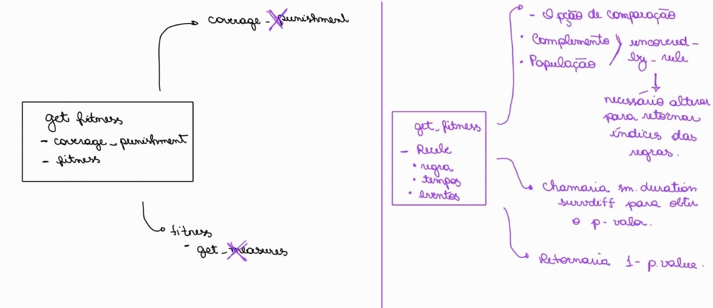

# Adaptação algoritmo ESMAM para o EASD
## Como funciona a função objetivo do ESMAM?

Função objetivo é uma expressão matemática que representa o critério de um problema de otimização, buscando maximizar ou minimizar o resultado.

Vamos analisar a função `set_fitness` do código:

```python
    def set_fitness(self):
        # against population
        if self._comparison == 'population':
            times = self._Dataset.survival_times[1][self.sub_group_cases].to_list() + self._Dataset.survival_times[1].to_list()
            events = self._Dataset.events[1][self.sub_group_cases].to_list() + self._Dataset.events[1].to_list()
            group_id = ['sg'] * self._Dataset.survival_times[1][self.sub_group_cases].shape[0] + ['pop'] * self._Dataset.survival_times[1].shape[0]
            try:
                _, self.p_value = sm.duration.survdiff(time=times, status=events, group=group_id)
            except:
                print("!! Raise < sm.duration.survdiff > except rule-fitness:")
                print('...baseline: population')
                print('rule: {}'.format(self.antecedent))
                self.p_value = 1
        # against complement
        if self._comparison == 'complement':
            sg = pd.Series('sub_group', index=self.sub_group_cases)
            cpm = pd.Series('complement', index=self._complement_cases)
            group = pd.concat([sg, cpm], axis=0, ignore_index=False).sort_index()
            try:
                _, self.p_value = sm.duration.survdiff(self._Dataset.survival_times[1], self._Dataset.events[1], group)
            except:
                print("!! Raise < sm.duration.survdiff > except rule-fitness:")
                print('...baseline: complement')
                print('rule: {}'.format(self.antecedent))
                self.p_value = 1
        self.fitness = 1 - self.p_value
        return
```
### Sabemos que ele utiliza o teste estatístico log-rank 
### Qual é a ideia?
Comparar curvas de sobrevivência de dois grupos para ver se eles são signifitivamente diferentes. \

O algoritmo fornece duas opções para o grupo baseline a ser comparado: 'complement' e 'population', sendo cada um o que o próprio nome induz a ser, o complemento do grupo que pertence a regra e toda a população.

Ele vai avaliar os dois grupos pela função `duration.survdiff` que fornece procedimentos de teste para comparar distribuições de sobrivência.

Essa função vai calcular o `p-valor`.

=> Propoẽ regras que identificam padrões de tempo até um evento

### Qual é a semântica do p-valor no contexto de teste log-rank?

1. Hipótese Nula: A regra X (ex: idade > 50 and fumante == sim) das pessoas desse subgrupo NÃO é diferente do padrão de sobrevivência do grupo de referência. Qualquer diferença que vemos nos dados é por acaso.
2. Evidência: A função `sm.duration.survdiff` olha para os seus dados e calcula o p-valor.
3. Cenários: 
   1. P-valor alto (ex: 0.8)
   - Semântica: "Se a regra fosse inútil, haveria 80% de chance de vermos uma separação de curvas como esta (ou maior) só por sorte."

   - Conclusão: Isso não é nada surpreendente. Não temos evidência para rejeitar a H₀. A regra é provavelmente ruim/inútil.

   - Fitness (do ESMAM): fitness = 1 - 0.8 = 0.2 (Nota baixa).

   2. Cenário B: P-Valor BAIXO (ex: p = 0.01)

   - Semântica: "Se a regra fosse inútil, haveria apenas 1% de chance de vermos uma separação tão grande por pura sorte."

   - Conclusão: Isso é muito surpreendente! É altamente improvável que tenha sido sorte. Portanto, devemos rejeitar a H₀. A regra é excepcional e estatisticamente significativa. Ela encontrou um subgrupo que realmente tem um padrão de sobrevivência diferente.

   - Fitness (do ESMAM): fitness = 1 - 0.01 = 0.99 (Nota alta).
  
### Quais funções/parâmetros são dependentes?
#### Dados de sobrevivência 
- Um array com o tempo até o evento (ou censura) para cada instância do dataset
- Um array com o status do evento para cada instância
#### Parâmetros de configuração 
- Quer comparar com população inteira ou com o complemento?

## Como funciona a função objetivo do EASD?

As funções referentes a avaliação estão concentradas no arquivo `evaluation.py`.

#### Como funciona a função objetivo do EASD?
A função a ser otimizada é a métrica de qualidade utilizada para determinar quão interessantes são determinados conjuntos de subgrupos. No caso EASD a função é o WRACC (Weighted Relative Accuracy of a Rule) que também conhecida por ser uma medida de não usualidade ou ganho de Acurácia, ela representa o trade-off entre generalidade e acurácia relativa. 

QUESTÕES: 
* O critério de parada tem relação com cobertura -> como isso seria afetado??
* Olhar como as outras funções são afetadas por essa mudança
#### Quais funções estão relacionadas a isso?

- `get_fitness`: orquestra tudo
- `coverage_punishment`: calcula a penalidade, verifica se a regra não é muito geral
- `uncovered_by_rule`: FAz a contagem das linhas cobertas
- `get_measures`: Obtém suporte, confiança, wracc
- `fitness`: Retorna Wracc
- `uncovered_lines_by_class`: linhas não cobertas por uma regra -> utilizada no core.py


#### Vamos pensar em quais adaptações devem ser feitas:



#### Nova configuração do arquivo:

- `get_fitness`: orquestra tudo
- `uncovered_by_rule`: Retorna o índice das linhas cobertas pela regra
- `fitness`: Retorna 1 - pvalor
  
Em análise:
- `uncovered_lines_by_class`: linhas não cobertas por uma regra -> utilizada no core.py

#### Ok, até aqui parece tudo bem, vamos voltar alguns passos para trás para entender melhor os passos

- Dataset
  
O algoritmo EASD e o algoritmo ESMAM tratam de problemas de naturezas diferentes e portanto, é natural que possuam datasets que requeiram pré-processamentos distintos.

O EASD deverá incluir em seus pipeline a separação das colunas de eventos e de tempos das demais colunas. Isso é feito no ESMAM no arquivo `dataset.py`.

Vamos analisar suas funções:

| Nome | Função |
|------|--------|
| `__init__` | Construtor da classe, inicializa o dataset com dados de sobrevivência |
| `_constructor` | Método interno para processar os dados e configurar atributos |
| `size` | Property que retorna o número total de casos no dataset |
| `surv_name` | Property que retorna o nome do atributo de sobrevivência |
| `remove_covered_cases` | Remove casos cobertos das estatísticas de cobertura |
| `update_covered_cases` | Atualiza casos cobertos nas estatísticas de cobertura |
| `get_case_count` | Retorna a contagem de cobertura para cada caso |
| `get_col_index` | Retorna o índice da coluna pelo nome |
| `get_data` | Retorna uma cópia dos dados originais |
| `get_cases_coverage` | Retorna lista booleana indicando casos cobertos |
| `get_no_of_uncovered_cases` | Retorna o número de casos não cobertos |
| `get_uncovered_cases` | Retorna lista de índices dos casos não cobertos |
| `get_instances` | Retorna lista de índices de todas as instâncias |


- As funções relacionadas com pré-processar o dataset são:
  - _constructor
- Impactos:
  - Dispensa a necessidade do método get_classes, já que nessa nova configuração ele retita as coluna de eventos e de tempo do restante X - trata o restante como uma classe só.

PERGUNTA: Não tenho certeza em relação as outras funções, já que nós já temos métodos de gerenciamento de cobertura. -> fazer uma análise da diferença entre os dois métodos.

- Imbutir Generalização
  
PERGUNTA: A generalização era ponderada pela métrica WRAcc que antes estava inclusa no cálculo da função objetivo, agora como ponderar isso? Usar o mesmo método do ESMAM? -> Aprofundar em como ele faz isso

Fitness: mais adaptados ao ambiente
Criar uma nova função objetivo: capturar a regra geral do log rank, mas 
- menor pvalor - independente do tamanho do grupo
- 
---
## Mudança no Formato de Leitura do Dataset 
- Pré-processamento para análise de sobrevivência

 `_constructor`: separa os atributos tempo e eventos do restante
 - Gerenciamento de Cobertura 
    - Atributos Chave:

    self._uncovered_cases: Uma lista booleana (ex: [True, True, True, ...]) que marca quais linhas ainda precisam ser cobertas.

    self._count: Uma lista de contagem que rastreia quantas regras cobrem cada linha (importante para remoção).
    - Métodos Chave:

    update_covered_cases(covered_cases): Quando uma regra é encontrada, você chama este método. Ele marca as linhas como False em _uncovered_cases e incrementa o _count.

    get_no_of_uncovered_cases(): Simplesmente retorna a soma(self._uncovered_cases).

### Principais funções core.py

| Nome | Função |
|------|--------|
| `__init__` | Inicializa todos os parâmetros do algoritmo e componentes |
| `clean_and_convert` | Limpa e converte os dados de entrada para formato numérico |
| `get_classes` | Separa o dataset por classes para processamento individual |
| `adjust_interval` | Ajusta os intervalos das regras para se adequarem aos dados |
| `get_best` | Retorna o índice do melhor indivíduo na população. |
| `check_stop` | Verifica critérios de parada e reinicialização do algoritmo. |
| `get_top_k` | Retorna os índices dos K melhores indivíduos. |
| `population_restart` | Realiza reinicialização parcial da população. |
| `run` | Método principal que executa todo o algoritmo genético: Processa cada classe separadamente, Gera regras enquanto houver exemplos não cobertos, Aplica operadores genéticos (crossover e mutação), Controla critérios de parada e restart e Retorna resultados finais |

### Fluxo do algoritmo `run()`

1. Preparação dos dados → clean_and_convert(), get_classes()

2. Para cada classe:

- Enquanto exemplos não cobertos > suporte mínimo:

    - Gera população inicial → PopulationGenerator

    - Loop de gerações:

        - Avalia fitness → RuleEvaluator.get_fitness()

        - Aplica crossover → GeneticOperators.crossover()

        - Aplica mutação → GeneticOperators.mutation()

        - Verifica critérios de parada → check_stop()

        - Reinicia população se necessário → population_restart()

        - Seleciona melhor regra → get_best(), adjust_interval()

3. Avaliação final → Calcula métricas e formata resultados

Adicionar a lógica de modificação do dataset no .core
Mudar lógica de classes para a de curvas de sobrevivência 

